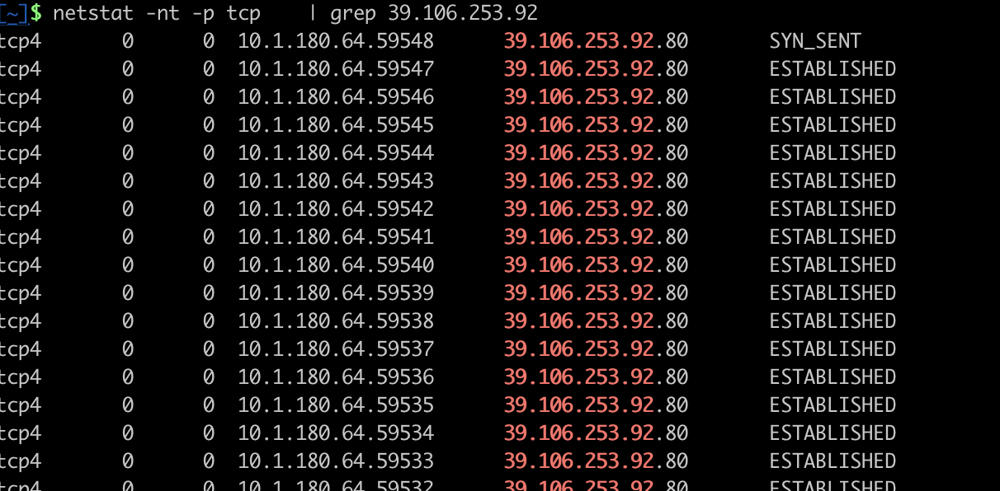
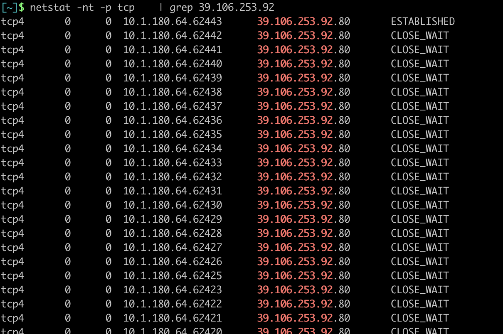
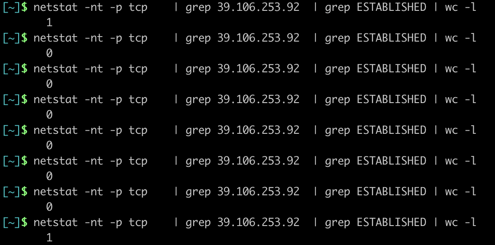

[TOC]

# 开启keepalive

> 测试之前，需要把client作为全局变量，公用客户端

```GO
//定义客户端，然后关闭keepalive
var client = http.Client{
	Transport: &http.Transport{
		DisableKeepAlives: false, //当需要频繁发生请求的时候，需要把keepalive关闭掉。避免无限建立连接。
	},
}

// http 客户端
func httpclient() {
	url := "http://wechat.glodon.com"
	req, err := http.NewRequest("GET", url, nil) //创建一个请求，是一个get请求，Qurl，需要传入的参数是nil
	if err != nil {
		fmt.Println("newrequest err:", err)
	}
	// 定义get请求的header
	req.Header.Add("User-Agent", "Mozilla/5.0 (Windows NT 10.0; Win64; x64) AppleWebKit/537.36 (KHTML, like Gecko) Chrome/73.0.3683.86 Safari/537.36")
	//获取respoes
	client.Do(req)
}
```

---

**可以看到全部都是established状态,并且还在持续的增加**




# 关闭keepalive

```go
//定义客户端，然后关闭keepalive
var client = http.Client{
	Transport: &http.Transport{
		DisableKeepAlives: true, //当需要频繁发生请求的时候，需要把keepalive关闭掉。避免无限建立连接。
	},
}

// http 客户端
func httpclient() {
	url := "http://wechat.glodon.com"
	req, err := http.NewRequest("GET", url, nil) //创建一个请求，是一个get请求，Qurl，需要传入的参数是nil
	if err != nil {
		fmt.Println("newrequest err:", err)
	}
	// 定义get请求的header
	req.Header.Add("User-Agent", "Mozilla/5.0 (Windows NT 10.0; Win64; x64) AppleWebKit/537.36 (KHTML, like Gecko) Chrome/73.0.3683.86 Safari/537.36")
	//获取respoes
	client.Do(req)
}
```
---

**可以很直观的看到连接都是建立发送完消息，就立马关闭了。并且只有一个established状态的连接。**



