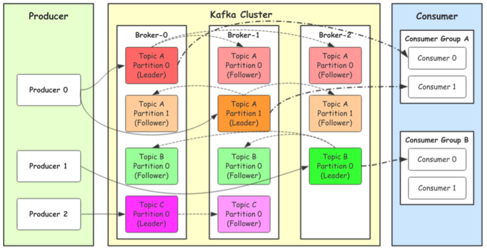

[TOC]

# kafka介绍

Kafka具有⾼吞吐、低延迟、高容错等特点

# kafka使用场景

- 行为跟踪：kafka可以用于跟踪用户浏览页面、搜索及其他行为。通过发布-订阅模式实时记录到对应的topic中，通过后端大数据平台接入处理分析，并做更进一步的实时处理和监控
- 日志收集：日志收集方面，有很多比较优秀的产品，比如Apache Flume，很多公司使用kafka代理日志聚合。日志聚合表示从服务器上收集日志文件，然后放到一个集中的平台（文件服务器）进行处理。在实际应用开发中，我们应用程序的log都会输出到本地的磁盘上，排查问题的话通过linux命令来搞定，如果应用程序组成了负载均衡集群，并且集群的机器有几十台以上，那么想通过日志快速定位到问题，就是很麻烦的事情了。所以一般都会做一个日志统一收集平台管理log日志用来快速查询重要应用的问题。所以很多公司的套路都是把应用日志集中到kafka上，然后分别导入到es和hdfs上，用来做实时检索分析和离线统计数据备份等。而另一方面，kafka本身又提供了很好的api来集成日志并且做日志收集。

## 消息队列的通信模型

### 点对点模式（queue）

消息生产者生产消息发送到queue中，然后消息消费者从queue中取出并消费消息。一条消息被消费以后，queue中就没有了，不存在重复消费

### 发布订阅（topic）

消息生产者（发布）将消息发布到topic中，同时有多个消费者（订阅）消费该消息。和点对点方式不同，发布到topic的消息会被所有订阅者消费（类似于关注了微信公众号的人，都能收到推送的消息）<br>

补充：发布订阅模式下，当发布者消息量很大时，显然单个订阅者的处理能力是不足的，实际上现实场景中是多个订阅者节点组成一个订阅组负载均衡消费topic消息即分组订阅，这样订阅者很容易实现消费能力线性扩展。可以看成是一个topic下有多个queue，每个queue是点对点的方式，queue之间发布订阅方式

## kafka集群架构



### producer

> producer生产者，消息的产生者，是消息入口

### cluster

#### broker

> broker是指部署了kafka实例的服务器节点。每个服务器上有一个或者多个kafka的实例，我们认为每个broker对应一台服务器。每个kafka集群内的broker都有一个不重复的编号，如broker-0、broker-1...

#### topic

> 消息的主题，可以理解为消息的分类，kafka的数据就保存在topic。每个broker上都可以创建多个topic。实际应用中通常是一个业务线建一个topic

#### partition

> topic的分区，每个topic可以有多个分区，分区的作用是做负载，提高kafka的吞吐量。同一个topic在不同的分区的数据是不重复的，partition的表现形式就是一个一个的文件夹

#### replication

> 每个分区都有多有副本，副本的作用是做备胎。当主分区（leader）故障的时候回选择一个备胎（follower）上位，称为leader。在kafka中默认副本的最大数量是10个，且副本的数量不能大于broker的数量，follower和leader绝对不能在同一台机器上，同一机器对同一个分区也只可能存放一个副本（包括他自己）

### consumer

> 消费者，即消息的消费方，是消息的出口

#### consumer group

>  我们可以将多个消费组组成一个消费组组，在kafka的设计中同一个分区的数据只能被消费组中的某一个消费者消费。同一个消费者组的消费者可以消费同一个topic的不同分区的数据，这也是为了提高kafka的吞吐量

## 生产者往kafka发送数据的流程(6步)


1. 生产者从kafka集群获取分区的leader信息
2. 生产者将消息发送到leader
3. leader将消息写入本地磁盘
4. follower从leader拉取消息数据
5. follower将消息写入本地磁盘后向leader发送ack确认
6. leader收到所有的follower的ack之后向生产者发送ack确认

## kafka选择分区的模式(3种)

1. partition在写入的时候可以指定需要写入的partition，如果有指定，则写入对应的partition
2. 如果没有指定partition，但是设置了数据的key，则会根据key的值hash出来partition
3. 如果既没指定partition，又没有设置key，则会采用轮询方式，即每次取一小段时间的数据写入某个partition，下一小段的时间写入下一个partition。

## 生产者往kafka发送数据的模式(3种)

producer在向kafka写入消息的时候，可以设置参数来确定是否确认kafka接收到数据。

1. 0：代表producer往集群发送数据不需要等到集群的返回，不确保消息发送成功。安全性最低、但是效率最高。
2. 1：代表producer往集群发送数据只要leader应答就可以发送下一条，只确保leader发送成功
3. all：代表producer往集群发送数据需要所有的follower都完成从leader的同步才会发送下一条，确保leader发送成功和所有的副本都完成备份。安全性最高、但是效率最低。

**注意：**如果往不存在的topic写数据，kafka会自动创建topic，partition和replication的数量默认都是1.

## 分区存储文件的原理

`topic`是同一类别的消息记录的集合。在kafka中，一个主题通常有多个订阅者。对于每个主题，kafka集群委会了一个分区数据日志文件结构如下


每个partition都是一个有序并且不可变的消息记录集合。当新的数据写入时，就被追加到partition的末尾。在每个partition中，每条消息都会被分配一个顺序的唯一标识，这个标识被称为`offset`，即偏移量。注意，kafka只保证在同一个partition内部消息是有序的，在不同partition之间，并不能保证消息有序。<br>

kafka可以配置一个`保留期限`，用来标识日志会在kafka集群内保留多长时间。`kafka集群会保留在保留期限内所有被发布的消息，不管这些消息是否被消费过`。比如保留期限设置为俩天，那么数据被发布到kafka集群的来俩天以内，所有的这些数据都可以被消费。当超出俩天，这些数据将会被清空，以便为后续的数据腾出空间。由于kafka会将数据进行持久化存储（写入磁盘），所以保留的数据大小可以设置为一个比较大的值。

## 为什么kafka快,partition结构

partition在服务器上的表现相似就是一个一个的文件夹，每个partition的文件下面会有多组segment文件，每组segment文件又包含`.index`文件、`.log`文件、`.timeindex`文件三个文件，其中`.log`文件就是实际存储message的地方，而`.index`和`.timeindex`文件为索引文件，用于检索消息。

## 消费者组消费数据的原理


**举个例子：**如上图所示一个两个节点的Kafka集群上拥有`⼀个四个partition(P0-P3)的topic`。有两个 消费者组都在消费这个topic中的数据，消费者组A有``两个消费者实例`，消费者组B有`四个消费者实例`。 从图中我们可以看到，在同一个消费者组中，每个消费者实例可以消费多个分区，但是每个分区最多只 能被消费者组中的一个实例例消费。<br>

也就是说，如果有⼀个4个分区的主题，那么消费者组中最多只能有4个消费者实例去消费，多出来的都不会被分配到分区。其实这也很好理解，如果允许两个消费者实例同 时消费同⼀个分区，那么就⽆法记录这个分区被这个消费者组消费的offset了。如果在消费者组中动态 的上线或下线消费者，那么Kafka集群会自动调整分区与消费者实例间的对应关系。

# 命令行

```shell
# 查看topic的状态
./kafka-topics.sh --list --zookeeper zookeeper.in:2181
```

# 操作kafka

## 往kafka发送消息

```GO
package main

import (
	"fmt"
	"github.com/Shopify/sarama"
)

// 基于sarama第三⽅库开发的kafka client
func main() {
	config := sarama.NewConfig()
  //指定kafka发送消息的配置
	config.Producer.RequiredAcks = sarama.WaitForAll // 发送完数据需要leader和follow都确认
	config.Producer.Partitioner = sarama.NewRandomPartitioner // 新选出⼀个 partition
	config.Producer.Return.Successes = true // 成功交付的消息将在success channel返回

	// 构造⼀个消息
	msg := &sarama.ProducerMessage{}
	msg.Topic = "web_log"
	msg.Value = sarama.StringEncoder("this is a test log")

	// 连接kafka
	client, err := sarama.NewSyncProducer([]string{"127.0.0.1:9092"}, config)
	if err != nil {
		fmt.Println("producer closed, err:", err)
		return
	}
	fmt.Println("连接kafka成功！")
	defer client.Close()
	// 发送消息
	pid, offset, err := client.SendMessage(msg)
	if err != nil {
		fmt.Println("send msg failed, err:", err)
		return
	}
	fmt.Printf("pid:%v offset:%v\n", pid, offset)
	fmt.Println("发送成功！")
}
```

## 从kafka读取消息

```GO
// 根据topic找所有的分区
// 每一个分区去消费数据
package main
import (
	"fmt"
	"github.com/Shopify/sarama"
)

func main() {
	consumer,err := sarama.NewConsumer([]string{"127.0.0.1:9092"},nil)
	if err !=nil {
		fmt.Printf("fail to start consumer,err:%v\n",err)
		return
	}
	partitionList,err := consumer.Partitions("redis_topic") // 根据topic取到所有的分区
	if err!=nil{
		fmt.Printf("fail to get list of partition:err:%v\n",err)
		return
	}
	fmt.Println(partitionList)
	for partition := range  partitionList { //遍历所有的分区
	
		//针对每个分区创建一个对应的分区消费者
		pc,err := consumer.ConsumePartition(
			"redis_topic",
			int32(partition),
			sarama.OffsetNewest)
		
		if err !=nil{
			fmt.Printf("failed to start consumer for partition %d,err:%v\n",err)
			return
		}
		defer pc.AsyncClose()

		//异步从每个分区消费信息
		go func(sarama.PartitionConsumer){
			for msg :=range pc.Messages(){
				//打印实时消费的信息
				fmt.Printf("partition:%d  offset:%d key:%v value:%v\n",msg.Partition,msg.Offset,msg.Key,msg.Value)
				fmt.Printf("partition:%d  offset:%d key:%v value:%v\n",msg.Partition,msg.Offset,string(msg.Key),string(msg.Value))
			}
		}(pc)
	}
	select{} //卡住，等待异步消费的信息
}
```

# kafka消费组使用

> 第三方包: github.com/bsm/sarama-cluster

```go
package kafka

import (
	"encoding/json"
	"fmt"
	"github.com/bsm/sarama-cluster"
	"os"
	"os/signal"
	"strconv"
	"strings"
	"time"
)


var (
	KafkaDataChan = make(chan []byte, 10000)
)

type kafkaDataStruct struct {
	Timestamp   string            `json:"@timestamp"`
	Beat        map[string]string `json:"beat"`
	Env         string            `json:"env"`
	Message     string            `json:"message"`
	ServiceName string            `json:"service_name"`
	Source      string            `json:"source"`
}


func Kafkas() {
	var (
		err error
    brokers = []string{"10.127.92.103:9092", "10.127.92.104:9092", "10.127.92.105:9092"}
    topics =[]string{"sg-nginx-logs"}
    group= "nginx-aggregation-group"
	)
  // 创建消费者配置文件
	config := cluster.NewConfig()
	config.Group.Mode = cluster.ConsumerModePartitions
	config.Net.MaxOpenRequests = 12
	config.ChannelBufferSize = 1024
  // 生成一个消费者组
	consumer, err := cluster.NewConsumer(brokers, group, topics, config)
	if err != nil {
		fmt.Println("kafka :", err)
	}
	// 生成一个接受系统信号的chan，并监听系统中断信号
	signals := make(chan os.Signal, 1)
	signal.Notify(signals, os.Interrupt)

  // 开启线程处理消息
	for i := 0; i < 30; i++ {
		go func() {
			for kafkaDataByte := range KafkaDataChan {
				kafkaData := kafkaDataStruct{}
				if err = json.Unmarshal(kafkaDataByte, &kafkaData); err != nil {
					fmt.Println("解析失败：", err)
				}
				esData := repleteWord(kafkaData.Message, kafkaData.ServiceName, kafkaData.Source)
				if esData.Url == "" {
					fmt.Println("丢弃空数据：", esData)
					continue
				}
				fmt.Println("EsClan堆积情况:", len(es.EsClan))
        // 处理完数据丢到esChan里面
				es.EsClan <- &esData
			}
		}()
	}

  // 每个分区都开启一个goroute，去kafka读消息，然后转存到kafkaDataClan里面
	for {
		select {
		case part, ok := <-consumer.Partitions():
			if !ok {
				return
			}
			go func(pc cluster.PartitionConsumer) {
				for msg := range pc.Messages() {
					fmt.Println("kafka堆积情况：", len(KafkaDataChan))
					KafkaDataChan <- msg.Value
				}
			}(part)
		case <-signals:
			return
		}
	}
}


func main(){
  Kafkas() 
}
```

# 别人封装好的的kafka消费组

```go
import (
	"context"
	"os"
	"os/signal"
	"sync"
	"syscall"
	"time"

	"github.com/Shopify/sarama"
	log "github.com/sirupsen/logrus"
)

type Kafka struct {
	brokers []string
	topics  []string
	//OffsetNewest int64 = -1
	//OffsetOldest int64 = -2
	startOffset       int64
	version           string
	ready             chan bool
	group             string
	channelBufferSize int
}

func NewKafka() *Kafka {
	return &Kafka{
		brokers: brokers,
		topics: []string{
			topics,
		},
		group:             group,
		channelBufferSize: 2,
		ready:             make(chan bool),
		version:           "1.1.1",
	}
}

var brokers = []string{"10.2.76.154:9092"}
var topics = "web_log"
var group = "39"

func (p *Kafka) Init() func() {
	log.Infoln("kafka init...")

	// 获取kafka版本信息
	version, err := sarama.ParseKafkaVersion(p.version)
	if err != nil {
		log.Fatalf("Error parsing Kafka version: %v", err)
	}
	config := sarama.NewConfig()
	config.Version = version
	config.Consumer.Group.Rebalance.Strategy = sarama.BalanceStrategyRange // 分区分配策略
	config.Consumer.Offsets.Initial = -2                                   // 未找到组消费位移的时候从哪边开始消费
	config.ChannelBufferSize = p.channelBufferSize                         // channel长度

	// 初始化一个context
	ctx, cancel := context.WithCancel(context.Background())
	consumerClient, err := sarama.NewConsumerGroup(p.brokers, p.group, config)
	if err != nil {
		log.Fatalf("Error creating consumer group client: %v", err)
	}

	wg := &sync.WaitGroup{}
	wg.Add(1)
	go func() {
		defer func() {
			wg.Done()
			//util.HandlePanic("client.Consume panic", log.StandardLogger())
		}()
		for {
			if err := consumerClient.Consume(ctx, p.topics, p); err != nil {
				log.Fatalf("Error from consumer: %v", err)
			}
			// 检查上下文是否已取消，表明使用者应该停止
			// check if context was cancelled, signaling that the consumer should stop
			if ctx.Err() != nil {
				log.Println(ctx.Err())
				return
			}
			p.ready = make(chan bool)
		}
	}()
	<-p.ready
	log.Infoln("Sarama consumer up and running!...")
	// 保证在系统退出时，通道里面的消息被消费
	return func() {
		log.Info("kafka close")
		// 关闭context
		cancel()
		wg.Wait()
		if err = consumerClient.Close(); err != nil {
			log.Errorf("Error closing client: %v", err)
		}
	}
}

// Setup is run at the beginning of a new session, before ConsumeClaim
func (p *Kafka) Setup(sarama.ConsumerGroupSession) error {
	// Mark the consumer as ready
	close(p.ready)
	return nil
}

// Cleanup is run at the end of a session, once all ConsumeClaim goroutines have exited
func (p *Kafka) Cleanup(sarama.ConsumerGroupSession) error {
	return nil
}

// ConsumeClaim must start a consumer loop of ConsumerGroupClaim's Messages().
func (p *Kafka) ConsumeClaim(session sarama.ConsumerGroupSession, claim sarama.ConsumerGroupClaim) error {

	// NOTE:
	// Do not move the code below to a goroutine.
	// The `ConsumeClaim` itself is called within a goroutine, see:
	// https://github.com/Shopify/sarama/blob/master/consumer_group.go#L27-L29
	// 具体消费消息
	for message := range claim.Messages() {
		msg := string(message.Value)
		log.Infof("来自kafka的消费信息  msg: %s", msg)
		time.Sleep(time.Second)
		//run.Run(msg)
		// 数据处理逻辑在这里，不需要调用ConsumeClaim,内部已经实现

		// 更新位移
		session.MarkMessage(message, "")
	}
	return nil
}

func main() {
	k := NewKafka()
	f := k.Init()

	// 创建获取系统中断信号的chan，并监听中断信号
	sigterm := make(chan os.Signal, 1)
	signal.Notify(sigterm, syscall.SIGINT, syscall.SIGTERM)
	select {
	case <-sigterm:
		log.Warnln("terminating: via signal")
	}
	f()
}

```

