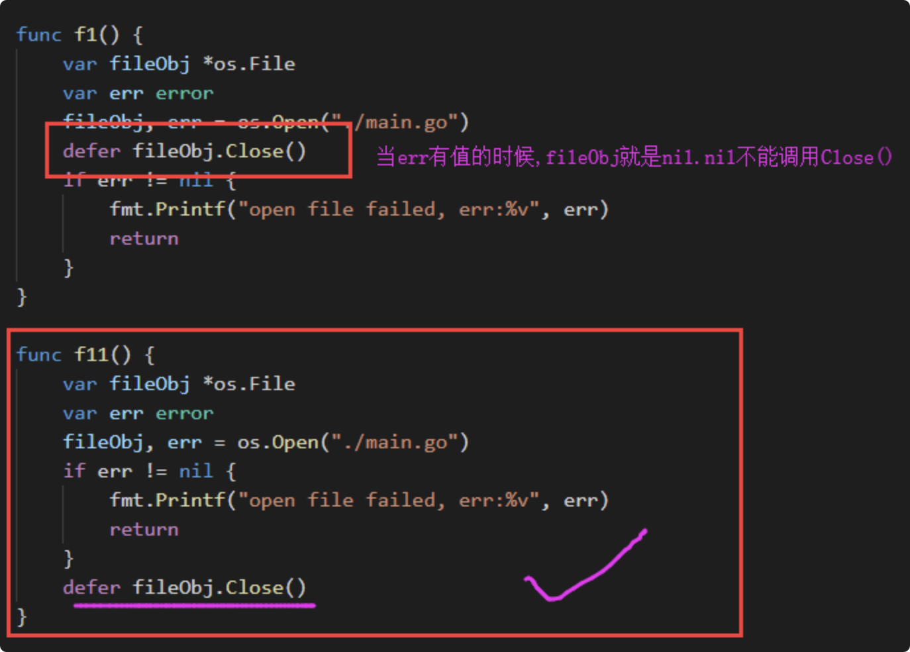

文件介绍
- [文件操作](#文件操作)
	- [读文件(3种方式)](#读文件3种方式)
		- [os包，按照固定长度读取文件内容](#os包按照固定长度读取文件内容)
		- [bufio包读取文件](#bufio包读取文件)
		- [ioutil包读取文件](#ioutil包读取文件)
	- [写文件(3种方式)](#写文件3种方式)
		- [使用os包,写入数据](#使用os包写入数据)
		- [使用bufio包写入数据](#使用bufio包写入数据)
		- [使用ioutil写入数据](#使用ioutil写入数据)
		- [使用fprintf往文件句柄中写入数据](#使用fprintf往文件句柄中写入数据)
	- [获取文件属性的详细信息](#获取文件属性的详细信息)
	- [注意使用defer关闭的合理位置：](#注意使用defer关闭的合理位置)

# 文件操作

## 读文件(3种方式)

### os包，按照固定长度读取文件内容

```go
//第一种方式：使用os包，按照固定长度读取文件内容
func read2file1() {
	fileObj, err := os.Open("./main.go")
	if err != nil {
		fmt.Printf("open file faild, err:%v\n", err)
		return
	}
	//关闭文件
	defer fileObj.Close()
	//读文件
	// var tmp = make([]byte, 128) //指定读的长度
	var tmp [128]byte
	for {
		n, err := fileObj.Read(tmp[:])
		if err == io.EOF {
			fmt.Println("读完了")
			return
		}
		if err != nil {
			fmt.Printf("read from file failed, err:%v\n", err)
			return
		}
		fmt.Printf("读了%d个字节\n", n)
		fmt.Println(string(tmp[:n]))
		if n < 128 {
			return
		}
	}
}
```
### bufio包读取文件
```GO
//利用bufio这个包读取文件
func read2filebybufio() {
	fileObj, err := os.Open("./main.go")
	if err != nil {
		fmt.Printf("open file faild, err:%v\n", err)
		return
	}
	//关闭文件
	defer fileObj.Close()
	reader := bufio.e(fileObj)
	for {
		line, err := reader.ReadString('\n') //按照字符’\n‘来分割每次读取长度
		if err == io.EOF {
			fmt.Println("读完了")
			return
		}
		if err != nil {
			fmt.Printf("read from file failed, err:%v\n", err)
			return
		}
		fmt.Print(line)
	}
}
```
### ioutil包读取文件
```GO
// 第三种 使用ioutil包读取文件
func read2FileByIoutil() {
	ret, err := ioutil.ReadFile("./main.go")
	if err != nil {
		fmt.Printf("read from file failed, err:%v\n", err)
		return
	}
	fmt.Println(string(ret))

}
```

## 写文件(3种方式)

| 标志位   | 解释                                                         |
| -------- | ------------------------------------------------------------ |
| O_RDONLY | open the file read-only  （必须指定）                        |
| O_WRONLY | open the file write-only（必须指定）                         |
| O_RDWR   | open the file read-write（必须指定）                         |
| O_APPEND | append data to the file when writing                         |
| O_CREATE | create a new file if none exists                             |
| O_EXCL   | used with O_CREATE, file must not exist.                     |
| O_SYNC   | open for synchronous I/O.（同步方式打开，没有缓存，这样写入内容直接写入硬盘，系统掉电文件内容有一定保证） |
| O_TRUNC  | truncate regular writable file when opened.                  |

### 使用os包,写入数据

```GO
//文件中写入数据，使用os包
func writeDome1() {
	fileObj, err := os.OpenFile("./xx.txt", os.O_WRONLY|os.O_CREATE|os.O_TRUNC, 0644)
	if err != nil {
		fmt.Printf("open file failed, err:%v", err)
		return
	}
	//write
	fileObj.Write([]byte("使用os模块写入数据，使用[]byte转换为byte类型的切片!\n"))
	//writeString
	fileObj.WriteString("使用os模块按照string类型写入！")
	fileObj.Close() //关闭文件
}
```
### 使用bufio包写入数据
```go
// 使用bufio包写入数据
func writeDome2() {
	fileObj, err := os.OpenFile("./xx.txt", os.O_WRONLY|os.O_CREATE|os.O_TRUNC, 0644)
	if err != nil {
		fmt.Printf("open file failed, err:%v", err)
		return
	}
	defer fileObj.Close()
	//创建一个写的对象
	wr := bufio.NewWriter(fileObj)
	wr.WriteString("使用bufio模块按照string类型写入！")
	wr.Flush()
}
```
### 使用ioutil写入数据
```go
//使用ioutil写入数据
func writeDome3() {
	str := "hello 沙河"
	err := ioutil.WriteFile("./xx.txt", []byte(str), 0666)
	if err != nil {
		fmt.Println("write file failed, err:", err)
		return
	}

}

func main() {
	writeDome1()
	writeDome2()
	writeDome3()
}
```

### 使用fprintf往文件句柄中写入数据
```GO
// 第四种，使用fprintf往文件句柄中写入数据
func fpint() {
	// 向标准输出写入内容
	fmt.Fprintln(os.Stdout, "向标准输出写入内容")
	fileObj, err := os.OpenFile("./xx.txt", os.O_CREATE|os.O_WRONLY|os.O_APPEND, 0644)
	if err != nil {
		fmt.Println("打开文件出错，err:", err)
		return
	}
	name := "沙河小王子"
	// 向打开的文件句柄中写入内容
	fmt.Fprintf(fileObj, "往文件中写如信息：%s", name)
}
```
## 拷贝文件-Copy模块

```go
//copyfile使用
func copyf(dstName, srcName string) (written int64, err error) {
	//以读的方式打开文件
	src, err := os.Open(srcName)
	if err != nil {
		fmt.Printf("open %s failed, err:%v.\n", srcName, err)
		return
	}
	defer src.Close()
	//以写的方式打开目标文件
	dst, err := os.OpenFile(dstName, os.O_WRONLY|os.O_CREATE, 0644)
	if err != nil {
		if err != nil {
			fmt.Printf("open %s failed, err:%v.\n", dstName, err)
			return
		}
	}
	defer dst.Close()
	return io.Copy(dst, src)
}
func cmcopyf() {
	_, err := copyf("dst.txt", "src.txt")
	if err != nil {
		fmt.Println("copy file failed, err:", err)
		return
	}
	fmt.Println("copy done!")
}
```


## 获取文件属性的详细信息

```go
// 1. 文件对象的类型
// 2. 获取文件对象的详细信息
func fileInfo() {
	fileObj, err := os.Open("/Users/liuqixiang/project/go_study/src/oldbody.com/day6/02file_demo/main.go")
	if err != nil {
		fmt.Printf("open file failed,err:%v\n", err)
		return
	}
	fileInfov, err := fileObj.Stat()
	if err != nil {
		fmt.Printf("get file info failed,err:%v\n", err)
		return
	}
	fmt.Printf("文件大小是：%dB\n", fileInfov.Size())
	fmt.Printf("文件名称是：%s\n", fileInfov.Name())
}

```
## 注意使用defer关闭的合理位置：
>一定要在打开文件后判断完err，才能使用defer，来记录关闭的事件


