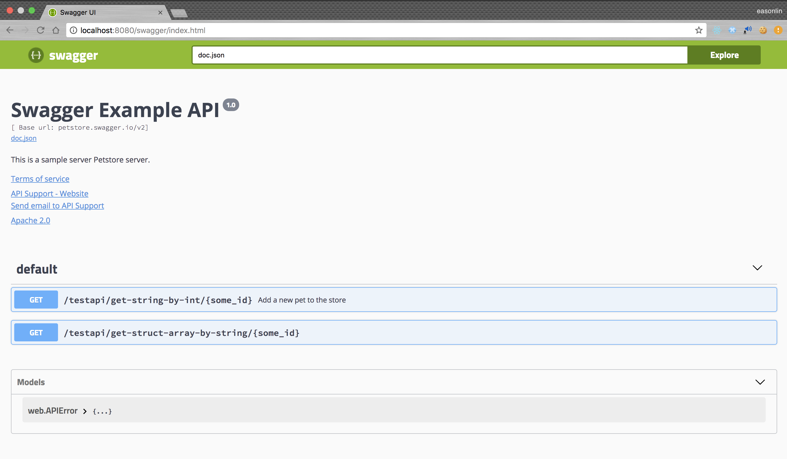

[toc]

Java使用Spring Boot写Restful API时，可以在代码里用注解来标识API，编译为Jar包后，运行时Web应用可以直接托管API文档。具体的可以参考文章：[使用swagger来做API文档](https://ieevee.com/tech/2018/01/10/swagger.html)。

那么golang系有没有类似的做法呢？

有是有的，只是没有springfox的那么方便就是了。

[swaggo](https://github.com/swaggo/swag)提供了golang版本的swagger自动生产Restful API文档，其做法是在代码中按swaggo的格式编写api的注释，然后swaggo会去解析这些注释，生成swagger的文档以及托管到网络的框架代码（主要是init（）函数），最终将代码编译到网络应用中，达到api文档托管的目的。

由于我的Restful框架用的是gin，所以下面以[gin-swagger](https://github.com/swaggo/gin-swagger)为例，说明swaggo的用法。

### 安装swag命令行

要使用swaggo，首先要下载一个swag命令行。

```go
go get github.com/swaggo/swag/cmd/swag
```

在$ GOPATH / bin /下会看到多了一个swag。把$ GOPATH / bin /加到PATH后，就可以直接用`swag`命令行了。

在包含`main.go`的Go工程的根目录下执行`swag init`，swag会检索当前工程里的swag注解（类似上述Java中的注解），生成`docs.go`以及`swagger.json/yaml`。

### 获取gin专用的gin-swagger

里面包含了一个示例代码。

```go
$ go get -u github.com/swaggo/gin-swagger
$ go get -u github.com/swaggo/gin-swagger/swaggerFiles
```

### 编写gin-swagger需要的注释

接下来就是编写注释了。注释分为两部分，一是整体应用的说明，二是具体api的说明。

#### 整体应用的说明

在主入口main.go中增加：

```go
import "github.com/swaggo/gin-swagger" // gin-swagger middleware
import "github.com/swaggo/gin-swagger/swaggerFiles" // swagger embed files
```

以及针对该应用程序的api说明。

```go
package main
import (
	"github.com/gin-gonic/gin"
	"github.com/swaggo/gin-swagger"
	"github.com/swaggo/gin-swagger/swaggerFiles"

	_ "github.com/swaggo/gin-swagger/example/docs"
)

// @title Swagger Example API
// @version 0.0.1
// @description  This is a sample server Petstore server.
// @BasePath /api/v1/
func main() {
	r := gin.New()
	r.GET("/swagger/*any", ginSwagger.WrapHandler(swaggerFiles.Handler))
	r.Run()
}
```

请注意`@BasePath`。 ？swagger注释中说明的`@BasePath`，，`@Router`而不是gin代码中声明的路径（没那么智能）。

#### 具体api的说明

```go
//
// @Summary Add a new pet to the store
// @Description get string by ID
// @Accept  json
// @Produce  json
// @Param   some_id     path    int     true        "Some ID"
// @Success 200 {string} string	"ok"
// @Failure 400 {object} web.APIError "We need ID!!"
// @Failure 404 {object} web.APIError "Can not find ID"
// @Router /testapi/get-string-by-int/{some_id} [get]
func GetStringByInt(c *gin.Context) {
	err := web.APIError{}
	fmt.Println(err)
}
```

说明下几个参数。

如果不需要参数（例如，获取所有类型的，由url就齐活了），则不需要加@Param。参数可以是int或字符串类型。这里的定义会影响swagger ui发送的请求，如果定义错了会导致发送请求的数据不对，例如对数字进行了转义。

```go
// @Param group body model.SwagGroupAdd true "Add group"
// @Param name path string true "Group Name"
// @Param role query int true "Role ID"
```

@Success和@Failure定义了返回值，类型可以是字符串，对象，数组。按照一般的[restful定义](http://www.ruanyifeng.com/blog/2014/05/restful_api.html)，这三个类型足够表达返回值了。

```go
GET /collection：返回资源对象的列表（数组）
GET /collection/resource：返回单个资源对象
POST /collection：返回新生成的资源对象
PUT /collection/resource：返回完整的资源对象
PATCH /collection/resource：返回完整的资源对象
DELETE /collection/resource：返回一个空文档
```

不过有些不太标准的restful实践会在上述返回之上再包装一个代码/消息/正文，所以对swaggo来说会造成一些新的负担，因为必须为这些返回类型单独加对应的类型。这项。

#### swag初始化

在项目根目录里执行`swag init`，生成`docs/docs.go`；再执行`go run main.go`，访问`http://localhost:8080/swagger/index.html`，就可以愉快的使用swagger ui了。

